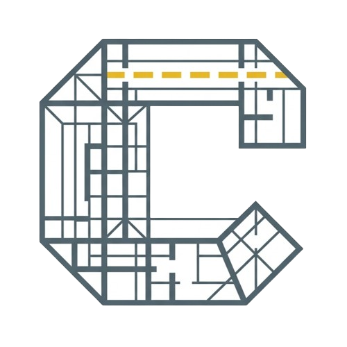
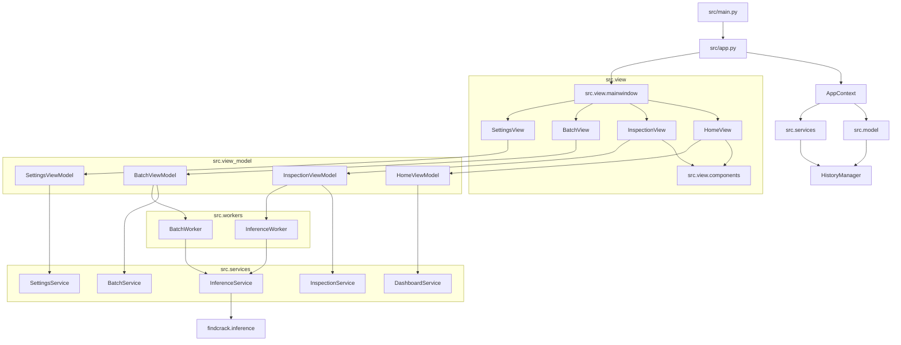

# Roof Surface Crack Inspection Suite


<div align="center">
    
</div>


An enterprise-grade desktop application built with **PySide6** and **Python** for executing, visualizing, and reporting AI-powered roof crack detection. The app integrates neural network models from the `findcrack` library (supporting U-Net and YOLO architectures) and executes CPU/GPU inference asynchronously.

---

## Application Architecture

The project follows MVVM with a small application composition layer. Views own UI widgets only, ViewModels own UI state and signals, services own domain/file/inference work, and workers isolate long-running inference from the Qt event loop.



---

## Submodule Breakdown

Every directory in `src/` functions as an independent Python package with a dedicated `__init__.py` file exposing a clean public API (`__all__`). This isolates implementation files and prevents dependency cycles.

### 1. `src.app` (Composition Root)
- **Role**: Creates `QApplication`, `HistoryManager`, shared `InferenceService`, and `MainWindow`.
- **Key Modules**:
  - `AppContext`: Shared dependency container passed into the UI shell.

### 2. `src.model` (State & Configuration)
- **Role**: Handles database loading, saving, and local setting management.
- **Key Modules**:
  - `HistoryManager`: Manages `settings/config.json` and the local run database `settings/history.json`.

### 3. `src.view` (Views)
- **Role**: Distinct layout panels mapped to sidebar navigation items.
- **Key Modules**:
  - `MainWindow`: Sets up the application shell and sidebar navigation using QFluentWidgets' `FluentWindow`.
  - `HomeView`: Main dashboard displaying overall KPI statistics, 7-day inspection trends, and a quick-action overview of the last 10 runs using Fluent components.
  - `InspectionView`: Interactive single-image detection view where a user can configure model params, view overlays, zoom/pan results, and export PDF reports.
  - `BatchView`: Configures batch queues for image directories, processes queues using worker threads, and copies outputs to custom destinations.
  - `SettingsView`: Interactive forms to override system defaults, adjust styling colors, change default paths, and clear history.

### 4. `src.view_model` (ViewModels)
- **Role**: Exposes Qt signals/slots and UI state between views and services.
- **Key Modules**:
  - `HomeViewModel`: Dashboard refresh and record deletion.
  - `InspectionViewModel`: Single-image workflow, history loading, and PDF export.
  - `BatchViewModel`: Batch folder workflow, cancellation, and file completion handling.
  - `SettingsViewModel`: Settings persistence and history maintenance.

### 5. `src.view.components` (Reusable GUI Widgets)
- **Role**: Self-contained UI components shared across views.
- **Key Modules**:
  - `ImageViewer`: A graphics view subclass enabling mouse wheel zooming, cursor panning, and drag-and-drop file loading.
  - `InspectionChart`: A chart component representing 7-day bar graphs showing the ratio of inspected-to-cracked roofs.

### 6. `src.services` (Domain Services)
- **Role**: Owns business logic, file persistence, settings conversion, dashboard aggregation, and model inference cache.
- **Key Modules**:
  - `InferenceService`: Loads/caches `findcrack` pipelines, applies runtime config, and shapes inference results.
  - `InspectionService`: Saves single-image result assets and records history.
  - `BatchService`: Saves batch output copies and records history.
  - `DashboardService`: Computes KPIs and recent records.
  - `SettingsService`: Converts setting values and builds config dictionaries.

### 7. `src.workers` (Background Processing)
- **Role**: Performs intensive image transformations and deep learning model inference in parallel threads, preventing GUI freezing.
- **Key Modules**:
  - `InferenceWorker`: Runs single-image sliding-window predictions.
  - `BatchWorker`: Processes queues of images with cancellation capabilities and saves progress signals.

### 8. `src.reports` (Automated PDF Reporting)
- **Role**: Formats results and saves them in offline document formats.
- **Key Modules**:
  - `PDFReportGenerator`: Reads and interpolates values in the HTML report template and prints them to an A4 PDF using Qt’s native print engine.
  - `report_template.html`: The HTML and CSS layout template used for constructing the final inspection report documents.

---

## Developer Maintenance & Upgrade Guide

### How to Add a New Neural Network Model
1. If the new model is published to the `findcrack` library:
   - Go to `src/view/inspection_view.py`, `src/view/batch_view.py`, and `src/view/settings_view.py`.
   - Add the variant identifier to the `QComboBox` setup (e.g., `self.combo_model.addItems(["YourNewModelName"])`).
2. `InferenceService` loads the model variant through `CrackInferencePipeline.from_pretrained(variant=...)` and shares cached pipelines across single and batch workflows.

### How to Create a New Navigation View
1. Add your new view file to `src/view/` (e.g., `src/view/analytics_view.py`).
2. Expose the new class in `src/view/__init__.py`:
   ```python
   from .analytics_view import AnalyticsView
   __all__ = [..., "AnalyticsView"]
   ```
3. Add matching ViewModel in `src/view_model/` when the view has state or actions.
4. Instantiate and register the view in `src/view/mainwindow.py`:
   - Set unique object name in `setup_views()` (e.g., `self.page_analytics.setObjectName("analyticsView")`).
   - Add view to sidebar in `setup_navigation()` using `self.addSubInterface(self.page_analytics, FIF.PLACEHOLDER, "Analytics")`.

### How to Optimize/Change UI Components
- Reusable components reside inside `src/view/components/`. If you create a new widget that is utilized in more than one view, place it there, and add it to `src/view/components/__init__.py`.

---

## System Configuration

The system's configurations are saved dynamically in `settings/config.json`. 
- For a template blueprint, see [config.json.example](file:///D:/codes/projects/interns/intern-year-four/crack/roof-crack-detection/settings/config.json.example).
- For a full breakdown of parameters, types, and defaults, refer to the [Configuration Guide](file:///D:/codes/projects/interns/intern-year-four/crack/roof-crack-detection/docs/configuration.md).

---

## Best Practices & Coding Standards

1. **Explicit Packages**: Always define an `__init__.py` in folders inside `src/`. Export public symbols using `__all__`.
2. **Stable Imports**: Import sub-modules from the package level rather than directly from specific module filenames (e.g., use `from src.workers import InferenceWorker` instead of `from src.workers.inference_worker import InferenceWorker`). This decouples logic and enables code refactoring without breaking dependents.
3. **Fluent Design Consistency**: Use `qfluentwidgets` controls (e.g., `PushButton`, `ComboBox`, `Slider`, `SimpleCardWidget`, `BodyLabel`, `SubtitleLabel`) instead of raw PySide6 equivalents to ensure native styling, light/dark mode compliance, and standard Windows 11 animations. Do not hardcode style properties or border colors.
4. **Decoupled Business Logic**: Never run model inference, file writing, or heavy PDF rendering inside UI classes. Always offload these workloads to the appropriate background workers.
