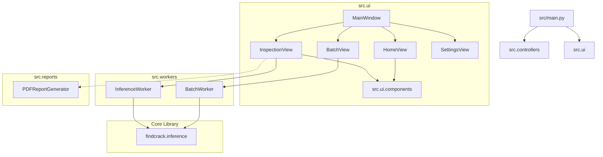

# Roof Surface Crack Inspection Suite

An enterprise-grade desktop application built with **PySide6** and **Python** for executing, visualizing, and reporting AI-powered roof crack detection. The app integrates neural network models from the `findcrack` library (supporting U-Net and YOLO architectures) and executes CPU/GPU inference asynchronously.

---

## 🏛️ Application Architecture

The system is structured as a fully decoupled, component-based modular architecture to ensure easy maintainability, testability, and upgrades.



---

## 📂 Submodule Breakdown

Every directory in `src/` functions as an independent Python package with a dedicated `__init__.py` file exposing a clean public API (`__all__`). This isolates implementation files and prevents dependency cycles.

### 1. `src.controllers` (State & Configuration)
- **Role**: Handles database loading, saving, and local setting management.
- **Key Modules**:
  - `HistoryManager`: Manages `settings/config.json` and the local run database `settings/history.json`. It provides methods to save configuration parameters, record results, and purge cache directories.

### 2. `src.ui` (User Interface Views)
- **Role**: Contains the MainWindow shell and distinct views corresponding to navigation panels.
- **Key Modules**:
  - `MainWindow`: Setups the application theme (Windows Classic Style), left navigation sidebar, and holds the view stack.
  - `HomeView`: Main dashboard displaying overall KPI statistics, 7-day inspection trends, and a quick-action overview of the last 10 runs.
  - `InspectionView`: Interactive single-image detection view where a user can configure model params, view overlays, zoom/pan results, and export PDF reports.
  - `BatchView`: Configures batch queues for image directories, processes queues using worker threads, and copies outputs to custom destinations.
  - `SettingsView`: Interactive forms to override system defaults, adjust styling colors, change default paths, and clear history.

### 3. `src.ui.components` (Reusable GUI Widgets)
- **Role**: Self-contained UI components shared across views.
- **Key Modules**:
  - `ImageViewer`: A graphics view subclass enabling mouse wheel zooming, cursor panning, and drag-and-drop file loading.
  - `InspectionChart`: A chart component representing 7-day bar graphs showing the ratio of inspected-to-cracked roofs.

### 4. `src.workers` (Background Processing)
- **Role**: Performs intensive image transformations and deep learning model inference in parallel threads, preventing GUI freezing.
- **Key Modules**:
  - `InferenceWorker`: Runs single-image sliding-window predictions.
  - `BatchWorker`: Processes queues of images with cancellation capabilities and saves progress signals.

### 5. `src.reports` (Automated PDF Reporting)
- **Role**: Formats results and saves them in offline document formats.
- **Key Modules**:
  - `PDFReportGenerator`: Compiles inspection metadata, severity recommendations, and side-by-side original/overlay images into a clean HTML template, printing it to an A4 PDF using Qt’s native print engine.

---

## 🔧 Developer Maintenance & Upgrade Guide

### How to Add a New Neural Network Model
1. If the new model is published to the `findcrack` library:
   - Go to `src/ui/inspection_view.py`, `src/ui/batch_view.py`, and `src/ui/settings_view.py`.
   - Add the variant identifier to the `QComboBox` setup (e.g., `self.combo_model.addItems(["YourNewModelName"])`).
2. The `InferenceWorker` and `BatchWorker` automatically load the model variant through `CrackInferencePipeline.from_pretrained(variant=...)`. Ensure the model cache supports your new variant name.

### How to Create a New Navigation View
1. Add your new view file to `src/ui/` (e.g., `src/ui/analytics_view.py`).
2. Expose the new class in `src/ui/__init__.py`:
   ```python
   from .analytics_view import AnalyticsView
   __all__ = [..., "AnalyticsView"]
   ```
3. Instantiate and wire up the view inside `src/ui/mainwindow.py`:
   - Add a navigation button in `setup_sidebar()`.
   - Add the view class to the `QStackedWidget` in `setup_views()`.
   - Connect the click events in `connect_signals()`.

### How to Optimize/Change UI Components
- Reusable components reside inside `src/ui/components/`. If you create a new widget that is utilized in more than one view, place it there, and add it to `src/ui/components/__init__.py`.

---

## 📝 Best Practices & Coding Standards

1. **Explicit Packages**: Always define an `__init__.py` in folders inside `src/`. Export public symbols using `__all__`.
2. **Stable Imports**: Import sub-modules from the package level rather than directly from specific module filenames (e.g., use `from src.workers import InferenceWorker` instead of `from src.workers.inference_worker import InferenceWorker`). This decouples logic and enables code refactoring without breaking dependents.
3. **Decoupled Business Logic**: Never run model inference, file writing, or heavy PDF rendering inside UI classes. Always offload these workloads to the appropriate background workers.
